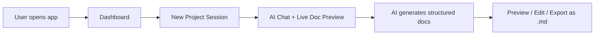

# PRD Creator — Full-Stack AI Document Factory

An AI-powered web app that creates **complete project documentation** — PRDs, design docs, tech stack specs, architecture docs — through a conversational chat interface with **Gemini 2.0 Flash**. System instructions are loaded from `.yaml` files, and generated documents are rendered as live-preview `.md` files.

## High-Level Flow



1. **Dashboard** → Lists past sessions (localStorage), button to start new
2. **Chat + Workspace** → Split-pane: left = AI chat, right = generated document preview
3. **AI driven by YAML** → System instructions loaded from `/instructions/*.yaml`
4. **Document generation** → AI creates full markdown docs (PRD, Design, Tech Stack, Architecture, etc.)
5. **Live preview** → Documents render as rich markdown in real-time
6. **Export** → Download individual docs or full project bundle as `.zip`

## Tech Stack

| Layer | Choice | Why |
|---|---|---|
| **Framework** | Next.js 15 (App Router) | SSR, API routes for Gemini proxy, React |
| **AI** | `@google/genai` + `gemini-2.0-flash` | Streaming chat, system instructions |
| **Instructions** | `.yaml` files | Modular, editable system prompts |
| **Markdown** | `react-markdown` + `remark-gfm` | GFM tables, code blocks, diagrams |
| **Styling** | Vanilla CSS (dark cybernetic theme) | No dependency overhead |
| **Syntax Highlight** | `rehype-highlight` | Code blocks in generated docs |
| **Export** | `jszip` + Blob API | Bundle docs as `.zip` |
| **Persistence** | localStorage | Sessions & generated docs |

## Architecture

```
prdbot/
├── instructions/
│   ├── prd-architect.yaml        # Main PRD system prompt (from .gemini)
│   ├── design-doc.yaml           # Design document generation
│   └── tech-stack.yaml           # Tech stack analysis
├── src/
│   ├── app/
│   │   ├── layout.js             # Root layout + fonts + global CSS
│   │   ├── page.js               # Dashboard (session list + new project)
│   │   ├── globals.css           # Full design system
│   │   └── session/
│   │       └── [id]/
│   │           └── page.js       # Chat + document workspace
│   ├── components/
│   │   ├── ChatPanel.js          # Chat messages + input
│   │   ├── DocPreview.js         # Markdown document viewer
│   │   ├── DocTabs.js            # Tab switching between generated docs
│   │   ├── MessageBubble.js      # Individual chat message (user/AI)
│   │   ├── SessionCard.js        # Dashboard session list item
│   │   └── ExportBar.js          # Export/download controls
│   ├── lib/
│   │   ├── gemini.js             # Server-side Gemini client
│   │   ├── instructions.js       # YAML loader
│   │   └── storage.js            # localStorage helpers
│   └── app/api/
│       └── chat/
│           └── route.js          # POST — streaming Gemini proxy
└── package.json
```

## Core Mechanics

### 1. YAML System Instructions
```yaml
# instructions/prd-architect.yaml
name: "APEX-CYBERNETIC PRD Architect"
model: "gemini-2.0-flash"
temperature: 0.7
systemInstruction: |
  You are a Principal Product Architect operating under Ashby's Law...
  [Full prompt from .gemini file]
documentTypes:
  - name: "PRD"
    template: |
      # {project_name} — Product Requirements Document
      ## Executive Summary
      ## Environmental Audit
      ...
  - name: "Design Document"
  - name: "Tech Stack Specification"
  - name: "Architecture Overview"
```

### 2. Streaming API Route
- `POST /api/chat` — accepts `{ message, history, instructionFile }`
- Loads YAML → creates Gemini chat with `systemInstruction`
- Streams response back via `ReadableStream`
- AI can output structured document blocks wrapped in `~~~doc:PRD` / `~~~` markers

### 3. Document Detection & Rendering
- AI outputs docs inside fenced markers: `~~~doc:DocumentType\n...content...\n~~~`
- Frontend parses these markers from the stream
- Extracts document content → renders in the **DocPreview** panel
- Multiple docs appear as **tabs** (PRD, Design, Tech Stack, etc.)

### 4. Split-Pane Workspace
- **Left panel**: Chat (streaming messages, user input)
- **Right panel**: Document preview (tabbed, rendered markdown)
- Resizable divider between panels

## Design Direction

- **Theme**: Deep black (#08080f), neon cyan (#00e5ff), electric green (#00ff88)
- **Fonts**: `JetBrains Mono` (headers/code), `Inter` (body)
- **Chat bubbles**: Glass-morphism user bubbles, solid dark AI bubbles with cyan borders
- **Doc preview**: Clean white-on-dark markdown rendering
- **Animations**: Smooth panel transitions, typing indicators, pulse effects on doc generation

## Proposed Changes

### Instructions (YAML)
#### [NEW] prd-architect.yaml
- Migrated from `.gemini` to structured YAML with metadata & document templates

---

### API Layer
#### [NEW] route.js
- Streaming Gemini proxy — loads YAML instructions, creates chat, streams response

---

### Pages
#### [NEW] page.js (Dashboard)
- Session list from localStorage, "New Project" button

#### [NEW] page.js (Session)
- Split-pane chat + document workspace

---

### Components
#### [NEW] `ChatPanel.js`, `DocPreview.js`, `DocTabs.js`, `MessageBubble.js`, `SessionCard.js`, `ExportBar.js`

---

### Lib
#### [NEW] `gemini.js` — Server-side SDK wrapper
#### [NEW] `instructions.js` — YAML file loader
#### [NEW] `storage.js` — localStorage session CRUD

## Verification Plan

### Automated
- `npm run build` — Verify clean build
- `npm run dev` — Start dev server, test in browser

### Browser Testing
1. Dashboard loads with empty state
2. "New Project" creates a session and redirects to workspace
3. Chat input sends message → streams AI response
4. AI generates a document → appears in DocPreview tabs
5. Export downloads `.md` file
6. Session persists after page reload
7. Responsive on mobile (stacked layout)
