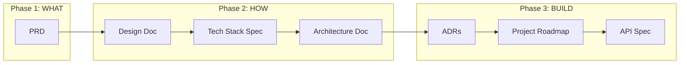

# Research Report: Perfect Project Documentation — Zero to Production

A deep-dive into how the best engineering organizations create project documents, and how our PRD Creator app should structure its output to match.

---

## The Document Hierarchy: What Gets Created & When

Every software project — from a weekend hack to an enterprise platform — follows a **documentation lifecycle**. The key insight: documents flow from **abstract → concrete**, each unlocking the next phase.

```mermaid
flowchart TD
    A["🧠 1. PRD\nProduct Requirements Document"] --> B["🏗️ 2. Design Document\nSystem Design & Architecture"]
    B --> C["⚙️ 3. Technical Specification\nImplementation Blueprint"]
    C --> D["📐 4. Architecture Decision Records\nKey Decision Log"]
    D --> E["🗺️ 5. Project Roadmap\nTimeline & Milestones"]
    E --> F["🧪 6. Test Plan\nQA Strategy"]
    F --> G["📦 7. Deployment Guide\nRelease Protocol"]
```



---

## 1. PRD — Product Requirements Document

**Purpose:** Defines *what* to build and *why*, from the user's perspective. Not *how*.

### Structure (Industry Standard)

| Section | Description |
|---|---|
| **Executive Summary** | 2-3 sentence problem + solution statement |
| **Problem Statement** | What pain exists and for whom |
| **User Personas** | Specific user types with goals, behaviors, pain points |
| **Goals & Success Metrics** | Measurable KPIs (e.g., "reduce churn by 15%") |
| **Functional Requirements** | Features broken into P0 (must-have), P1 (should-have), P2 (nice-to-have) using **MoSCoW** method |
| **User Stories** | "As a [persona], I want [action] so that [outcome]" |
| **User Flows** | Step-by-step paths through the product |
| **Non-Functional Requirements** | Performance, security, scalability, compliance |
| **Assumptions & Constraints** | Budget, timeline, tech limitations |
| **Risks & Dependencies** | What could go wrong + external dependencies |
| **Release Criteria** | Definition of "done" |
| **Open Questions** | Unresolved items |

### Key Sources
- [Perforce: PRD Template & Best Practices](https://www.perforce.com/blog/alm/how-write-product-requirements-document)
- [Product School: How to Write a PRD](https://productschool.com/blog/product-strategy/product-requirements-document)
- [ChatPRD.ai](https://chatprd.ai) — AI PRD tool reference

> **💡 Tip:** Modern PRDs read like **blog posts with data**, not 50-page specs. Focus on *insight density* over length.

---

## 2. Design Document (Google-Style)

**Purpose:** Defines *how* the system works at a high level. The place to document **trade-offs**.

### Structure (from Google's Engineering Culture)

| Section | Description |
|---|---|
| **Context & Scope** | Rough overview of the landscape — what exists, what's changing |
| **Goals & Non-Goals** | Explicit about what's IN and OUT of scope |
| **The Actual Design** | System-context diagrams, APIs, data storage, key algorithms |
| **Alternatives Considered** | Other approaches and why they were rejected |
| **Cross-Cutting Concerns** | Security, privacy, observability |

### Key Principles (from Google)
- Design docs are **informal** — write in whatever form makes sense
- Focus on **trade-offs**, not exhaustive specs
- Include a **system-context diagram** showing your system in the broader landscape
- Sketch APIs, don't copy-paste formal definitions
- Rarely include code — link to prototypes instead
- Length: aim for what's needed, no more

### Source
- [**Design Docs at Google** — Industrial Empathy (Malte Ubl)](https://www.industrialempathy.com/posts/design-docs-at-google/) ⭐ Essential reading

---

## 3. Technical Specification

**Purpose:** The **implementation blueprint** — bridges business requirements to engineering work. Details *exactly how* to build it.

### Structure (from Stack Overflow's Guide)

**Front Matter:**
- Title, Author(s), Team, Reviewers, Created/Updated dates, Issue tracker link

**Introduction:**
- Problem overview (user perspective)
- Glossary / terminology
- Context / background
- Goals (product & technical requirements as user stories)
- Non-Goals / Out of Scope
- Future Goals
- Assumptions

**Solutions:**
- Current solution analysis (pros/cons)
- Proposed solution with:
  - Data model / schema changes
  - API changes
  - Business logic (pseudocode, flowcharts, error states)
  - Presentation layer (wireframes, UI states, error handling)
  - Scalability, limitations, failure recovery
- Test plan (unit, integration, QA)
- Monitoring & alerting plan
- Release / rollout plan (feature flags, phased deployment)
- Rollback plan
- Alternate solutions (with migration path)

**Further Considerations:**
- Impact on other teams, third-party services, cost analysis, security, privacy, accessibility

**Success Evaluation:**
- Metrics, dashboards, success criteria timeline

### Sources
- [**Stack Overflow: A Practical Guide to Writing Technical Specs**](https://stackoverflow.blog/2020/04/06/a-practical-guide-to-writing-technical-specs/) ⭐ Essential reading
- [FullClarity: Tech Spec Template](https://fullclarity.co.uk)

---

## 4. Architecture Documentation (C4 Model)

**Purpose:** Visualize the system's structure at multiple zoom levels.

### The Four Levels

| Level | What It Shows | Audience |
|---|---|---|
| **L1: System Context** | Your system + users + external systems | Everyone (business + tech) |
| **L2: Container** | Applications, databases, APIs within your system | Dev team + architects |
| **L3: Component** | Modules/services inside each container | Developers |
| **L4: Code** | Class/function level (usually auto-generated) | Individual developers |

### Source
- [**C4 Model** — Simon Brown](https://c4model.info) ⭐ The standard for architecture visualization

---

## 5. Architecture Decision Records (ADRs)

**Purpose:** Capture *why* specific technical decisions were made. Future-proof knowledge.

### Structure

```markdown
# ADR-001: [Decision Title]

**Status:** Proposed | Accepted | Deprecated | Superseded
**Date:** YYYY-MM-DD

## Context
[What problem or requirement drove this decision]

## Decision  
[What was chosen and why]

## Alternatives Considered
[Other options and why they were rejected]

## Consequences
[Trade-offs, implications, what changes as a result]
```

### Best Practices
- **Immutable** — don't modify accepted ADRs, supersede them with new ones
- **One decision per ADR**
- **Store in repo** (`docs/adr/`) alongside code
- Link ADRs to C4 diagrams for full traceability

### Sources
- [TechTarget: ADR Best Practices](https://www.techtarget.com/searchapparchitecture/tip/A-guide-to-documenting-architecture-decisions)
- [InfoQ: Architecture Decision Records](https://www.infoq.com/articles/architecture-decision-records/)

---

## 6. Complete "Zero to 100" Document Flow

This is the **full lifecycle** a project follows from idea to production:

| Phase | Documents Created | Owner |
|---|---|---|
| **💡 Ideation** | PRD, Market Requirements (MRD) | Product Manager |
| **🏗️ Design** | Design Document, Architecture Doc (C4) | Tech Lead / Architect |
| **📋 Specification** | Technical Spec, ADRs, API Spec | Engineers |
| **🗺️ Planning** | Project Roadmap, Sprint Plans | PM + Engineering |
| **🔨 Development** | Code Documentation, Internal Process Docs | Engineers |
| **🧪 Testing** | Test Plans, Test Cases, Bug Reports | QA |
| **🚀 Deployment** | Deployment Guide, Release Notes | DevOps + PM |
| **📊 Post-Launch** | Monitoring Runbook, Incident Response, Retrospective | Ops + Team |

### Source
- [Akava: Startup Documentation Guide](https://akava.io)
- [First Round Review: Engineering Documentation](https://firstround.com)

---

## How This Shapes Our PRD Creator

Based on this research, our app should generate **7 document types** in a structured workflow:



Each document type should have:
1. A **YAML instruction file** with domain-specific system prompts
2. A **template skeleton** the AI fills in during conversation
3. **Guided interrogation** — the AI asks targeted questions before generating
4. **Live preview** — rendered markdown as the document is built
5. **Export** — individual `.md` files or bundled `.zip`

---

## Key References (Bookmarkable)

| Resource | What It Covers |
|---|---|
| [Design Docs at Google](https://www.industrialempathy.com/posts/design-docs-at-google/) | How Google structures design docs |
| [Stack Overflow: Writing Tech Specs](https://stackoverflow.blog/2020/04/06/a-practical-guide-to-writing-technical-specs/) | Complete tech spec template with examples |
| [C4 Model](https://c4model.info) | 4-level architecture visualization standard |
| [HashiCorp RFC Process](https://works.hashicorp.com/articles/writing-practices-and-culture) | How HashiCorp runs RFCs |
| [ChatPRD.ai](https://chatprd.ai) | AI-powered PRD generator (competitive reference) |
| [Product School: PRD Guide](https://productschool.com/blog/product-strategy/product-requirements-document) | Modern PRD writing best practices |
| [Atlassian: Design Documents](https://www.atlassian.com/software/confluence/templates/design-document) | Design doc templates |
| [Brian Sigafoos: Design Doc Template](https://briansigafoos.com/design-docs/) | Google-inspired design doc template |
